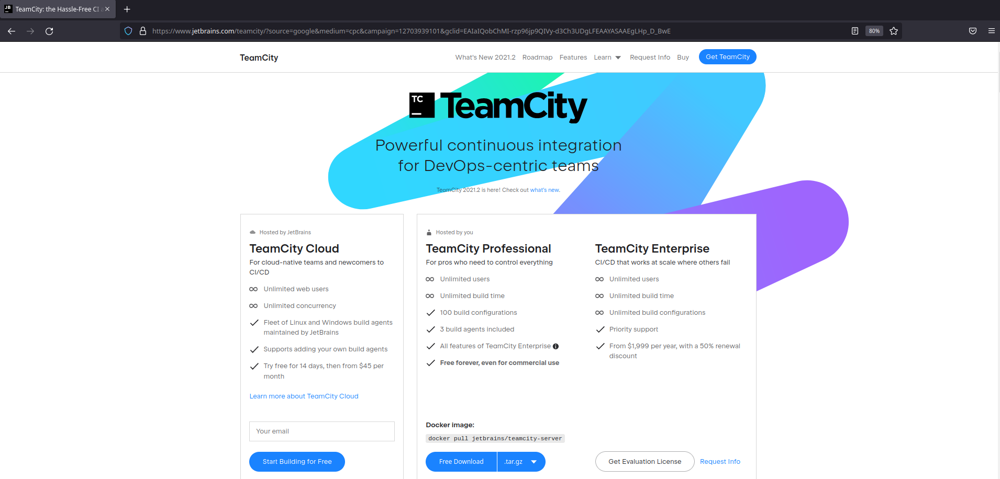
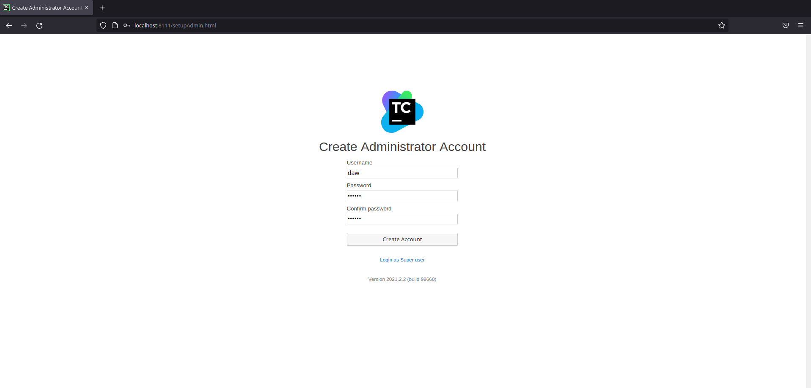
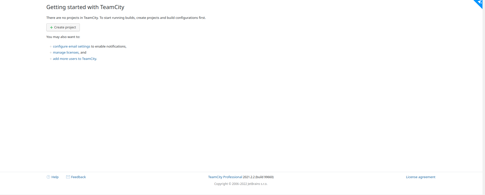

Joel Rodriguez Martín
2º DAW

<h1 align="center"> 
   Team City: CI-CD 
</h1>

## Indice
[Introducción](#introduccion)           	
[Historia](#historia)  
[Licencia y descarga](#licencia)  
[Instalación](#instalacion)  
[Herramientas con las que se relaciona](#herramientas)  
[Definición y ejemplo de pipeline](#pipeline)  
[Conclusión](#conclusion)  

### Introduccion:
TeamCity es una herramienta utilizada para integración continua y manejo de builds. A continuación trataremos sus ventajas, desventajas y particularidades como herramienta de cara al desarrollo.

### Historia:

TeamCity es un servidor de integración continua y manejo de builds desarrollado por JetBrains, empresa detrás de herramientas e IDEs tan conocidos como IntelliJ, PHPStorm y el lenguaje de programación Kotlin. Fue creado en 2006 y desde entonces sigue en continuo desarrollo y mantenimiento.

### Licencia y descarga:
Esta herramienta es utilizable por cualquiera bajo licencia. La principal y que utilizaremos es una licencia “freemium” es decir, licencia gratuita, incluso para uso comercial, con algunos servicios limitados bajo pago. La limitación que recibe esta licencia es 100 configuraciones de build y 3 agentes de compilación como máximo. 
Esto suele ser suficiente para desarrolladores en solitario, y para empresas la licencia de pago les permitiría configuraciones y agentes ilimitados.
La descarga es sencilla, en nuestro caso utilizaremos Linux, y desde la página oficial de JetBrains podremos descargar el programa comprimido para su uso:  

 

### Instalación:
Como requisito previo a la utilización de TeamCity será necesario tener instalado Java JRE o JDK, ya que es una aplicación basada en Java. Comprobamos la versión de java y asignamos un JAVA_HOME en caso de que no lo haya:  

A continuación ya podremos ejecutar el script de inicio del servidor, ya que en Linux no requiere de instalación. Navegamos a la carpeta en la que se encuentra y ejecutamos el script runAll, que ejecuta el servidor con un agente por defecto:  

Con el parámetro “start” iniciaremos el servidor y cuando queramos cerrarlo lo ejecutaremos con “stop”.

Ahora podremos acceder a la interfaz desde el navegador en local usando el puerto 8111.

En primera ejecución habrá que realizar una configuración. Especificaremos el directorio de datos.  
 
Especificaremos la base de datos (En este caso la interna, para hacer pruebas).  
 
Y creamos una cuenta de administrador.  
Con todos estos pasos realizados la aplicación estará lista para usar:  
 

### Herramientas con las que se relaciona:
Al tratarse TeamCity de una herramienta creada por JetBrains está en continuo desarrollo y permite con el uso de plugins la integración con los principales IDEs, por ejemplo:

   
   
   
   

IDEs JetBrains: IDEA, PyCharm, PhpStorm… Todos estos IDEs al ser desarrollados por la misma empresa poseen plugins que integran directamente con TeamCity, permitiendo ver los datos de builds y pipelines, editarlos, lanzar builds etc. Todo desde el propio IDE, sin necesidad de acceder a la propia herramienta.

Eclipse: Eclipse posee un plugin diseñado para permitir lanzar builds y ver los resultados de builds anteriores desde su propia interfaz.

Visual Studio Code: Este programa también incluye un plugin que permite utilizar toda la potencia de TeamCity desde el IDE, permitiendo al usuario hacer todas sus operaciones desde el mismo programa.

Git: TeamCity permite al usuario la creación de proyectos desde repositorios de Git, permitiendo al usuario hacer pruebas sobre proyectos remotos.

### Definición y ejemplo de pipeline:
Para demostrar la utilización de esta herramienta crearemos un proyecto y un pipeline de prueba.
En primer lugar crearemos un proyecto de prueba desde la URL de un repositorio de Git:
Este contendrá una app de ejemplo sencilla de Maven.
https://github.com/mkjetbrains/SimpleMavenSample

En este caso no será necesaria la identificación de usuario, pero en caso de ser un repositorio privado habría que introducirla.

TeamCity escanea el repositorio y detecta automáticamente pasos para la build. En este caso al ser un proyecto Maven nos sugiere como primer paso realizar un Maven clean test. Podemos aceptar los pasos sugeridos o añadirlos posteriormente si queremos. En este caso aceptaremos este primer paso.

En la página de la build podremos añadirle nuevos pasos a la build o modificar los que tenemos, además de ejecutar los pasos actuales.
Vamos a probar a añadirle un nuevo paso a nuestra build, antes de ejecutar el test de maven comprobaremos la versión de maven:

Como podemos ver podemos elegir con que “Runner” se ejecutará nuestro paso, permitiendo utilizar gran cantidad de herramientas como Docker, Maven e incluso proyectos de IDEs. En este caso utilizaremos la linea de compandos y colocaremos el script deseado en el campo de texto.

Comprobamos que los pasos solo se ejecutarán si el anterior tuvo exito y ejecutamos nuestra build.

El resultado de la build habrá tenido éxito y podremos revisar paso por paso el resultado.
TeamCity permite además generar y guardar los archivos que puedan producir nuestras pipeline y builds, por ejemplo .war o .zip:
En la página de build abajo a la derecha podremos publicar por ejemplo la carpeta target y TeamCity nos permitirá tener los .war publicados duirante la ejecución.

Además en la sección triggers podremos programar ejecuciones con diferentes disparadores, por ejemplo en determinadas fechas o cuando ocurren determinadas acciones, a continuación ejemplo de una ejecución diaria:
Estas dos particularidades le proporcionan a TeamCity una gran potencia ya que al automatizar tanto la ejecución como la recogida de resultados (.war, .zip, logs) y poder acceder a ellos desde la propia plataforma ahorrará al usuario gran cantidad de tiempo y trabajo.

### Conclusión:
TeamCity es una herramienta para la integración continua con una gran potencia, respaldada por una empresa líder en el mercado. Esto hace que sea una herramienta ideal, ya que recibirá soporte durante años, además de estar fuertemente integrada con muchas herramientas de uso común hoy en día (Git, Docker, IDEs). A pesar de sus ventajas y potencia es una herramienta compleja, que requiere tiempo para adquirir soltura y en el caso de empresas grandes tiene un coste asociado a su uso.
